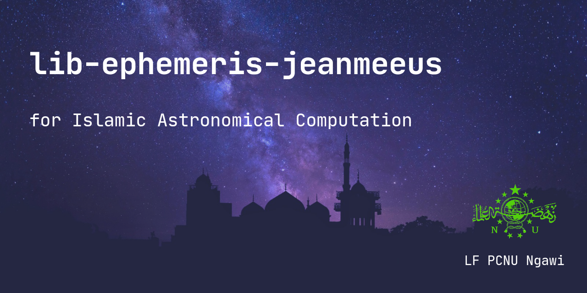

<p align="center">
  
</p>

<h2 align="center"><b>lib-ephemeris-jeanmeeus</b></h2>
<p align="center">
<b>Astronomical calculation library with Jean Meeus Algorithm</b>
<p><br>

<p align="center">
<!-- Latest release -->

<!-- Jitpack release -->

<!-- Github Repo size -->

<!-- Build with Kotlin -->

<!-- License -->

</p>

# Tentang Algoritma Jean Meeus
Algoritma Jean Meeus merupakan reduksi dari model VSOP87 & ELP2000/82 full

# Dokumentasi penggunaan
- [Dokumentasi](https://hasanelfalakiy.github.io/lib-ephemeris-jeanmeeus/docs/index.html)

## Fitur

- [x] Data Posisi Matahari & Bulan
- [x] Arah Qiblat & Rashdul Qiblat
- [x] Waktu Sholat
- [ ] Hisab Ijtima & Awal Bulan Hijriyah
- [ ] Fase-fase Bulan

## Konfigurasi pertama

1. Masukkan kode ini ke settings.gradle.kts (root kotlin dsl) di blok ```repositories```
```kotlin.kts
  dependencyResolutionManagement {
    repositories {
      // contoh
      maven {
        url = uri("https://jitpack.io")
      }
    }
  }
```
Jika menggunakan groovy dsl
```groovy
  repositories {
    maven { url 'https://jitpack.io' }
  }
```
2. Masukkan dependensi ke build.gradle.kts (app/build.gradle.kts kotlin dsl)
di dalam blok ```dependencies``` 

```kotlin.kts
implementation("com.github.hasanelfalakiy:lib-ephemeris-jeanmeeus:2.0.1")
```
jika menggunakan groovy dsl
```groovy
implementation 'com.github.hasanelfalakiy:lib-ephemeris-jeanmeeus:2.0.1'
```
## Ingin berkontribusi?

> Jika Anda ingin berkontribusi, silahkan menggarpu (Fork) repositori ini, clone ke local machine, buat perubahan, push ke repositori fork, kirim pull request ke repositori ini

## Kontak Kami

- [Telegram](https://t.me/moonelfalakiy)
- [Grup diskusi Telegram](https://t.me/moonlight_studio01/9)

## License

```
lib-ephemeris-jeanmeeus

Copyright (C) 2024  Andi Hasan Ashari

lib-ephemeris-jeanmeeus is free software: you can redistribute it and/or modify
it under the terms of the GNU General Public License as published by
the Free Software Foundation, either version 3 of the License, or
(at your option) any later version.

lib-ephemeris-jeanmeeus is distributed in the hope that it will be useful,
but WITHOUT ANY WARRANTY; without even the implied warranty of
MERCHANTABILITY or FITNESS FOR A PARTICULAR PURPOSE.  See the
GNU General Public License for more details.

You should have received a copy of the GNU General Public License
along with lib-ephemeris-jeanmeeus.  If not, see <https://www.gnu.org/licenses/>.
```
Report to us if anyone violates the terms of the License, either by creating issues or writing to us directly.
